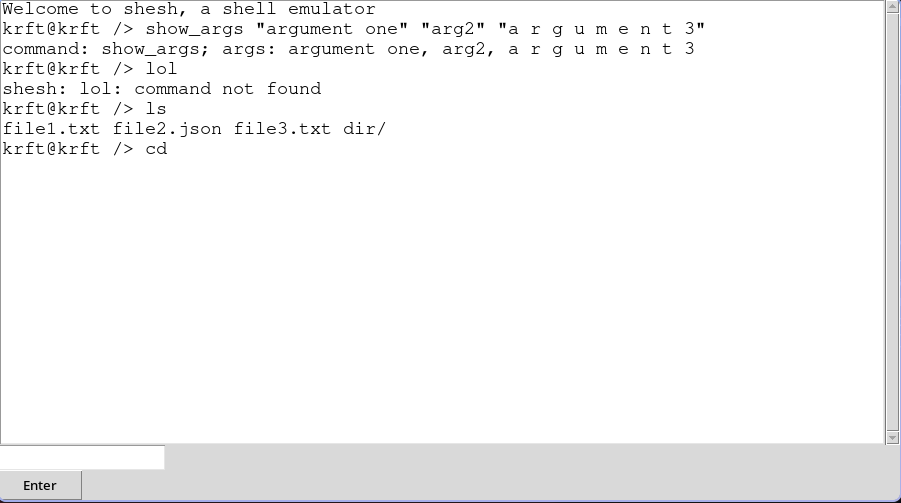

# Общее описание
GUI-приложение для эмулятора языка оболочки Unix-подобной ОС.

# Описание функций и настроек
## Команды
- `exit` - Закрыть окно приложения
- `cd` - Вывод команды и ее аргументов
- `ls` - Вывод команды и ее аргументов

## Предзагрузка файлов
Для предзагрузки файлов в VFS, необходимо создать XML-файл следующего формата:
```xml
<directory name="имя">
    <file name="имя">{закодированное в base-64 содержание}</file>
</directory>
```

## Стартовый скрипт
При загрузке VFS, выполняются команды из стартового скрипта следующего формата:
```
# комментарий
<команда> <аргументы>
```

# Описание команд для сборки проекта и запуска тестов
Запуск VFS:
```
python main.py path/to/xml path/to/init/script
```

Запуск тестов аргументов коммандной строки для запуска VFS:
```
python test/emulator_cli_args.py .
```
Запуск тестов для минимального количества файлов
```
python test/vfs_minimal.py .
```
Запуск тестов для небольшого количества файлов
```
python test/vfs_few_files.py .
```
Запуск тестов для нескольких уровней директорий и файлов
```
python test/vfs_multilevel.py .
```

# Примеры использования

