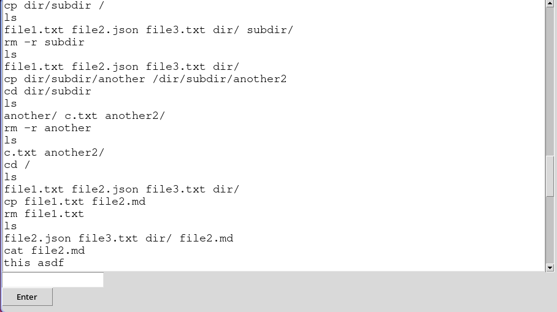

# Общее описание
GUI-приложение для эмулятора языка оболочки Unix-подобной ОС.

# Описание функций и настроек
## Команды
- `exit` - Закрыть окно приложения
- `ls` - Вывод команды и ее аргументов. Поддерживаются аргументы в
  кавычках
- `cd` - Вывод команды и ее аргументов. Поддерживаются аргументы в
  кавычках

# Описание команд для сборки проекта и запуска тестов
Запуск VFS:
```
python main.py
```

# Примеры использования

```
python main.py
```

